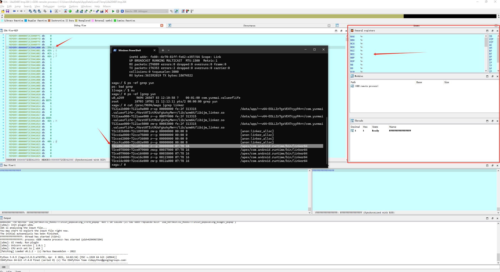

前言
对抗是安全绕不开的话题，漏洞利用有专门用于防利用缓解措施，逆向分析有专门用于对抗的防逆向分析机制，对抗虽然不是安全问题的本身，但是想要进行安全分析，却需要首先完成对抗。


## 绕不开的frida
### frida是一款跨时代的黑客工具集大成者
从技术上来说，frida并没有很强的技术问题，他只不过是将在动态逆向分析中所需要的各种技术全部缝合起来，然后提供远程调用，这样相对的方便。当然也有别的黑客工具可能也这样做过，但是都没做大，可能兼容不好，可能不支持很多平台，可能不开源，frida本质还是一个软件工具，所以坚持更新并完善功能，也是一个重要的判断指标。
### frida无法进行对抗
frida工具是极为容易被检测的，不管你怎么改都没用，就像我上一篇写的对抗问题，本质就是特征检测，而frida开源，就导致了很容易进行，特定的特征检测，有很多针对这一方面改了，但是他还有通用特征检测，根本无法改变。
+ 大量的符号字符串，像frida这么大的项目，想改变不亚于再写一个
+ vala语言写的，vala语言虽然是要转变成c的，但是你能确定这个语言在转变的过程中没有保留语言特征，毕竟应用本身是没有vala语言环境和特征的
+ v8引擎集成，有些应用，确实集成了v8,但是大部分估计没有，所以这依然可以作为一个标准，而且深挖的话，你可以去找他那些专属于frida功能的接口。
+ 远程调用通讯
+ 还有各个平台本身的库特征

### frida的“尴尬”
frida无疑是一款非常好的逆向工具，不，他是一款软件产品，别的都只能算是半成品工具。frida带来了良好的体验，极大的降低了入门的门槛，但是随着对抗问题的出现，这个工具开始“尴尬”了，因为你想使用frida，就需要先完成frida的对抗问题。而且现在国内的知名厂商，安全公司，安全部门，都对很多都对frida进行了防护，你想进行这种高强度的对抗frida已经不能满足这种要求了。在我看来，frida更适合测试，漏洞挖掘这种弱对抗行业。

#### 感谢frida的开源,感谢它陪我走了那么旧，让我学到了那么多，但是他的开源，也完全成了他弱对抗的根本原因，所以很多黑客工具不开源，用起来很爽，不开源是有道理的。


## 如何“再造乾坤”
自从frida被对抗以后，工作都开始停滞了，所以很早的时候我就开始思考这个问题，如何能做一个像frida这样的工具，并且能够强对抗，或者说，一款应用注入工具，而不被检测。


### 从零开始是否具有意义
在安全行业，工具虽然多，但是相比于庞大的人数来说，比例是很小，这也预示着想写一个工具的难度，而且不只是技术难度，很多工具对抗问题，即使是工具开发者有可能也没有意识到，同时没有任何资料告诉你，如何写这一类的工具，没有任何教程，只能去扒源码，这也是我写这个博客的目的之一。

#### 当前的“你”，在安全中的定位
先写点理论，从一个抽象的问题来看一看安全对抗的定位问题。
假如你是一个逆向者，你可以使用frida逆向很多app,但是如今已经无法对大公司的app，各个加固公司加固的app进行逆向了，假如安全行业是双方对垒，你是一个进攻方的士兵，这些很多可以逆向app，像不像手无寸铁的平民百姓，他们并没有太多的防护方案，任由你攻击他们的村庄，但是加固过的app,你根本无法攻击他们，他们就像加固过的堡垒，你要去攻击，最低的代价也是付出半条命。逆向代价极高，而防护方案确实极低的(这是安全公司在弱势时候的积累)。这个时候，你还认为你是安全行业中的攻击者吗，不，有木有可能，你是防守者，为什么这么说，因为，安全公司建造了一个巨大的盾牌，逆向的安全对抗中，本身就要首先绕过无数的检测，这是安全公司给你提供的高门槛，想要逆向就必须绕过。

攻防本身就是相对概念，抽象的看，相对弱势的哪一方，付出更大的代价的哪一方，其实才是防守者。

#### 如何成为“强势的攻击者”
不管你是黑客，还是安全公司，甚至是人类本性，都想掌握主动权，成为强势的一方。(这个其实跟商业发展对抗模式一样)
在frida初期，防护较少，而且由于使用方便，大大降低了入门门槛，这变相的提高了做安全的门槛。而现在安全公司随着时间和技术的积累，以及对于逆向对抗的分析和了解，构建了一个巨大的防御盾牌，假如你使用frida，首先需要完成frida对抗的工作，就像安全公司前期对抗frida，要做安全首先就需要先能对抗Frida,以及各种魔改的frida一样。

+ 正面对抗中击溃
	frida现在基本所有的安全公司都在防御他，而且，都能检测到，不管如何的变种，改特征，都无法绕过。假如逆向正面击溃，并且选择frida方向，就是能过找到所有检测的点，然后全部绕过他。难度极高，近乎于不可能。

+ 另辟蹊径
	frida的方向，已经被防御的死死了，作为一个小个体，我们正面对抗安全公司并且击溃他，几乎不太可能，所以。开发新工具，是一条更好的路。安全公司所有在frida方面的防御，对你来说都是无用功，攻防会重新回到起跑线，而你是攻击者，主动权在你。
	
#### 开发一个新的工具在对抗中是有意义的，已有工具，已知工具的对抗是极为激烈的，作为一个逆向人员，对抗的是整个安全公司的安全产品，在这相同的领域内，你是多么的天才，才能以一敌众，不如开辟新赛道，让一切归零。


### 一个强对抗工具可能需要具备的要素
+ 特有特征容易更改
	符号，字符串这些，so文件符号导出，字符串，java文件检测类名等等，这种问题一般都是需要去改源文件的，要确保可以付出尽量小的代价来修改这些问题，比如精简代码，确保工程足够小，或者在写的时候，就想好修改符号，字符串这些对抗问题。
	
+ 不开源
	这是最好的办法，如果它从不知道你的存在，甚至不会检测你，但是你也需要确保你的操作不会过分违规，否则会被捕获。

+ hideself
	每一个黑客工具，随着不断的使用，总有被发现的可能，这时候就会有捕获问题，而这个时候hideself技术就派上用场了，一旦被捕获了就会遭到分析，随之而来的就是检测对抗，如果你能不被捕获，或者能够隐藏好自身，让自动运行的程序无法发现，就不会有检测对抗问题

（总会有检测对抗的问题，不是吗）
+ 比安全工具更底层的位置
	对于程序来说，底层为上层提供技术支撑，对于安全来说，位于更底层的位置，对于上层是完全可以进行降为打击的。

+ 早于安全工具的时机
	这个非常重要，一般来说，在对抗双方技术相等的情况下，谁能更早的加载，谁就更容易的硬，更早加载的工具，理论上可以使用"沙箱"给后加载的工具提供一个伪造的环境，用于对抗和检测。
	
+ 减少对抗点
	这个其实也可以算是特征，共有特征，比如使用修改段属性的函数，可读可写可执行，不是安全公司的操作，就是黑客工具的操作。函数hook，如果应用本身没有内置hook库，在使用的时候，就有可能被检测到，尽量减少对抗点，恢复现场。
	
+ 外部库
	减少外部依赖，尤其是一些有前科的库，本身就会被检测的，或者特征较多，会被精准定位的，毕竟外部库你改不了源码，你使用了别人也使用，没法精准定位，但是只有你使用，就会成为特征
	
+ 模块化
	因为你永远不知道到底是那一部分被检测到了，把每一部都分开模块化，也能确保代码精简。让每一部分都可以分开独立测试，更容易快速找到问题所在，然后进行对抗。
	
### 上才艺---Android上一套不依赖于frida的逆向工具的简陋实现以及逆向方案
写道这里，突然觉得，自己写的工具，其实也很一般。。。
我在上一篇上写了很多对抗的问题，也算是在这一篇把一些坑填上。
你可以用，也不字不用自己写，宣传自己的项目是一个目的，但是也想恢复一下因为frida而被踩烂的逆向门槛，让更多人有可以去完成对抗的能力。

#### android全局注入管理工具---rxposed
https://github.com/Thehepta/rxposed

你可以理解为这是一个简陋版本的lsposed,通过ptrace注入zygote来实现的。

#### 自定义apk模块加载器---HideApk
https://github.com/Thehepta/HideApk

这种类xposed的注入工具，都是将外部apk注入到目标进程中，所以他们存在一个共同的问题，就是外部apk的检测问题，dex文件可以通过内存dex加载的方式解决，但是 so加载的问题一直没有解决，没有一个成熟的内存匿名so加载项目来解决这个问题，另外还有一个java native 函数注册的问题，我完成了一个自定义给的so 加载器（抄linker），来对抗检测问题。当然这个目前还是有一些可能被检测到的问题，待优化。


 #### java 底层环境对接--对象遍历
https://github.com/Thehepta/Rxmodule/tree/master/DavlikJvmRuntimeEnv

frida中提供了一种枚举类对象的功能，并且用这个实现了遍历类加载器，这个技术目前也没有人分享过，但是一定有很多人发现。他能解决所有的java逆向项目中找不到已加载的类的情况。这部分的原理是java底层环境本身就提供了一个对象遍历接口，而所有的类，其实也是对象，这个接口可以直接遍历类，但是我技术和时间有限，我导出了这个符号，然后将这个函数所需要的对象的结构体在工程中重写了出来，贴个代码水一下
```
//这个函数的 Visit 会被回调，传入所有的对象。
class LookupClassesVisitor : public ClassLoaderVisitor {
public:
    LookupClassesVisitor(JNIEnv *env, JavaVMExt *pExt) {

        int offsetOfVmExt = findOffset(env, 0, 10000, (void*) pExt);
//        LOGV("g_env offsetOfVmExt = %d",offsetOfVmExt);
        uint8_t * u_env = reinterpret_cast<uint8_t *>(env);
        jniEnvExt = reinterpret_cast<JNIEnvExt *>(u_env + offsetOfVmExt - sizeof(void *));

    }

    void Visit(ObjPtr<Object> class_loader)
    REQUIRES_SHARED(Locks::classlinker_classes_lock_, Locks::mutator_lock_) OVERRIDE {

        AndroidRunAPI* androidRunApi = AndroidRunAPI::getInstance();
        jobject classLoader_obj =  androidRunApi->AddGlobalRef( jniEnvExt->vm_,jniEnvExt->self_, class_loader);
        vec_obj.push_back(classLoader_obj);

    }

    std::vector<jobject> getVecObj(){
        return vec_obj;
    }

private:
    JNIEnvExt* jniEnvExt;
    std::vector<jobject> vec_obj;
};


void getAndroidSystemFunction(){
    AndroidRunAPI* androidRunApi = AndroidRunAPI::getInstance();

    androidRunApi->VisitClassLoaders = (void (*) (void* , void* ))resolve_elf_internal_symbol("libart.so","_ZNK3art11ClassLinker17VisitClassLoadersEPNS_18ClassLoaderVisitorE");
    androidRunApi->AddGlobalRef = (jobject (*)(void *, void *,ObjPtr<Object> ))resolve_elf_internal_symbol("libart.so","_ZN3art9JavaVMExt12AddGlobalRefEPNS_6ThreadENS_6ObjPtrINS_6mirror6ObjectEEE");


}

//有很多对比的代码，是在动态找runtime，抄袭别人的
jobjectArray getClassLoaders(JNIEnv *env, jint targetSdkVersion) {

    JavaVM *javaVM;
    env->GetJavaVM(&javaVM);
    JavaVMExt *javaVMExt = (JavaVMExt *) javaVM;
    void *runtime = javaVMExt->runtime;

    LOGV("runtime ptr: %p, vmExtPtr: %p", runtime, javaVMExt);
    LOGV("std::unique_ptr<PartialRuntime13> size: %d",  sizeof (std::unique_ptr<PartialRuntime13>));
    LOGV("get_heap_to_jvm_offset size: %d",  get_heap_to_jvm_offset());

    const int MAX = 5000;
    int offsetOfVmExt = findOffset(runtime, 0, MAX, (void*) javaVMExt);
    LOGV("offsetOfVmExt: %d", offsetOfVmExt);
    int head_offset = offsetOfVmExt-get_heap_to_jvm_offset()+sizeof (void*);
    LOGV("head_offset: %d", head_offset);
    void * heap = (char*)runtime + head_offset;
    AndroidRunAPI* androidRunApi = AndroidRunAPI::getInstance();
    LOGV("1");
    androidRunApi->partialRuntime = static_cast<PartialRuntime *>(heap);
    getAndroidSystemFunction();
    LOGV("1");
    LookupClassesVisitor visitor(env, javaVMExt);
    LOGV("1 %p",androidRunApi->VisitClassLoaders);

    androidRunApi->VisitClassLoaders(androidRunApi->partialRuntime->class_linker_,&visitor);
    LOGV("1");

    std::vector<jobject>  vectorObject =  visitor.getVecObj();
    jclass  ClassLoader_cls = env->FindClass("java/lang/ClassLoader");
    LOGV("2");

    for (auto it = vectorObject.begin(); it != vectorObject.end(); /* no increment here */) {
        jboolean re =  env->IsInstanceOf(*it,ClassLoader_cls);
        if(!re){
            it = vectorObject.erase(it);
        } else{
            ++it;
        }
    }

    jobjectArray objectArray = env->NewObjectArray(vectorObject.size(), ClassLoader_cls, NULL);

    for(int i=0;i<vectorObject.size();i++){
        env->SetObjectArrayElement(objectArray, i, vectorObject[i]);
    }
    return objectArray;
}

```
这种全局类对象遍历技术，也可以使用jvmti，不过我觉得太重，并且容易被对抗，所以更frida，一样，采用了这个。

#### java逆向观测技术---jvmti
https://github.com/Thehepta/Rxmodule/tree/master/DavlikJvmRuntimeEnv(里面的jvmti文件)

在java逆向中，抛开静态代码分析，动态运行我们一般都是用开源的hook技术来进行观测，但是我在分析frida的时候偶然发现了一种技术叫jvmti，我不知道为什么这么久都没人讲这个技术，因为他真的很好用，java的动态调试器是完全依赖于jvmti的，而且java动态调试器也只是使用了部分功能，他的完全体更加强大。比如，函数hook，他提供了函数拦截功能，变量监控功能，类加载，反正一堆底层强大功能，能对java运行环境进行你全面观测。前段时间看雪开源了一个jvmti的hook框架，我测试了一下，有些bug，反正我按照教程不能跑，但是他提供的demo确实是可以跑的。
	
这个技术在android上，主要是提供给调试应用的，所以正常的使用，必须要debug模式，但是经过研究发现release也是可以绕过限制来使用的，可以看看大佬博客：

https://juejin.cn/post/6942782366993612813

```
    AndroidRunAPI* androidRunApi = AndroidRunAPI::getInstance();
    androidRunApi->ensurePluginLoaded = (bool (*)(void *, const char*,std::string*))resolve_elf_internal_symbol("libart.so","_ZN3art7Runtime18EnsurePluginLoadedEPKcPNSt3__112basic_stringIcNS3_11char_traitsIcEENS3_9allocatorIcEEEE");
    auto (*SetJdwpAllowed)(bool) = reinterpret_cast<void (*)(bool)>(resolve_elf_internal_symbol("libart.so","_ZN3art3Dbg14SetJdwpAllowedEb"));
    auto (*setJavaDebuggable)(void *, bool) = reinterpret_cast<void (*)(void *, bool)>(resolve_elf_internal_symbol( "libart.so","_ZN3art7Runtime17SetJavaDebuggableEb"));


    if (SetJdwpAllowed != nullptr) {
        SetJdwpAllowed(true);
    } else{
        LOGV("SetJdwpAllowed  ==  null ");

    }
    JavaVM *javaVM;
    env->GetJavaVM(&javaVM);
    JavaVMExt *javaVMExt = (JavaVMExt *) javaVM;
    void *runtime = javaVMExt->runtime;
    constexpr const char* plugin_name = "libopenjdkjvmti.so";
    LOGV("stdout","%s","ensurePluginLoaded successful");
    std::string error_msg;

    if (setJavaDebuggable != nullptr) {
        setJavaDebuggable(runtime, true);
    }
    bool success = androidRunApi->ensurePluginLoaded(runtime,plugin_name,&error_msg);

    if(!success){
        LOGV("ensurePluginLoaded Failed");
    }

    jvmtiEnv *jvmti_env = CreateJvmtiEnv(javaVM);
```

这个工具目前有个问题，好像不能在抽取壳中使用，我试过某商业版，有可能是底层产生化学反应，没法支持，也有可能被检测到了


 #### native层观测问题---gdbinjec
 ida目前来说是最强的调试工具，但是在Android上只能调试使用，我曾经在native层遇到很多的内存动态对抗问题，需要时时的观察内存。prrace调试，兼容不一定好，还容易被对抗，我研究了一下gdb协议，将他改编成为了一个注入库，当然了，他是没有下断点，单步这些调试器才有的功能的，他唯一能够提供的就是观察内存，可以gdb去链接他，也可以使用ida的gdb功能去连接他，然后使用ida的反编译功能。开始本来想用idaserver改的，考虑到ida版本变更要换，就用gdb了。 

  这个目前还有bug，想使用反汇编，但是经常崩溃,在内存读取上有一些问题。有可能是ida中自动分析导致的。
拥有一个native内存读取功能，就可以提供最细颗粒度的观察，可以很多在这之上的扩展功能。你甚至可以不用gdb，谁便写一个读取内存的api，然后在native向往远程通讯提供api调用也也可以


  #### 脱抽取壳
  https://github.com/Thehepta/Rxmodule/tree/master/dumpdex

目前脱抽取壳的方案只有fart和frida-fart，而frida已经被对抗了，只有fart了。理论上来说，frida可以做，那么native就可以做。
frida-fart有一个难点就是类加载器遍历，但是前面有写，这个问题已经突破了，剩下的就是把frida-fart的代码，用native实现一边即可。这个大部分都写完了，但是有些问题，因为必须选中一个用户类加载完的时机调用，如果你去hook onCreate的这些函数的话，会被检测到，所以我想配合远程调用来进行脱壳。


#### 远程调用
https://github.com/Thehepta/androidRPC

逆向中加入远程调用，是我学了不久以后就有的想法，但是奈何当时技术不好，而frida更是强化了这个技术在逆向中的运用。它可以让逆向变得更加方便。我目前采用的是java rmi,提供远程调用，但是在有抽取壳的应用中无法使用，我怀疑是底层冲突。后续想试试native层的远程调用。我想将远程调用和本地运行时环境对接起来，这方面我只是提供一个思路，毕竟远程调用有很多库。


### android版本支持-13

差点忘了写，目前rxposed框架只支持android 13，主要原因是 so隐藏加载器的项目，目前并没有做android12的兼容，这个肯定是可以做的，简单一点的是不同的版本使用不同的soinfo结构体就可以，但是觉得不够优雅，而且版本多了以后，会很臃肿，我想用动态内存定位的方法来做一种全平台的自动兼容，但是可能要花一点时间和精力，暂时没做，rxposed如果没有隐藏so加载，会使用系统apk加载，不具备对抗性，所以暂时没做。


## 最后

从时间和周期上来看，自己写一个工具来对抗安全检测，本身确实是一件费力又不靠谱的事，但是如果如果你想真正完成对抗，并且彻底解决对抗问题，这个事情很靠谱

目前我在我自己的红米手机上使用，测试过一些安全公司的产品，并未发现异常。


### 无关技术
懒得，不规律，坚持和学习不够，自卑，自闭又杠精，我决定开个公众号和知识星球。


知识星球（没免费卷，想支持就支持一下，不想支持也没事，主要是希望可以接触到更多的问题，收集更多的样本）


动动你的小手给我的项目俩个start吧

如果你对我写的项目有兴趣，并且想加入进来一起写，请联系我


​	


​	